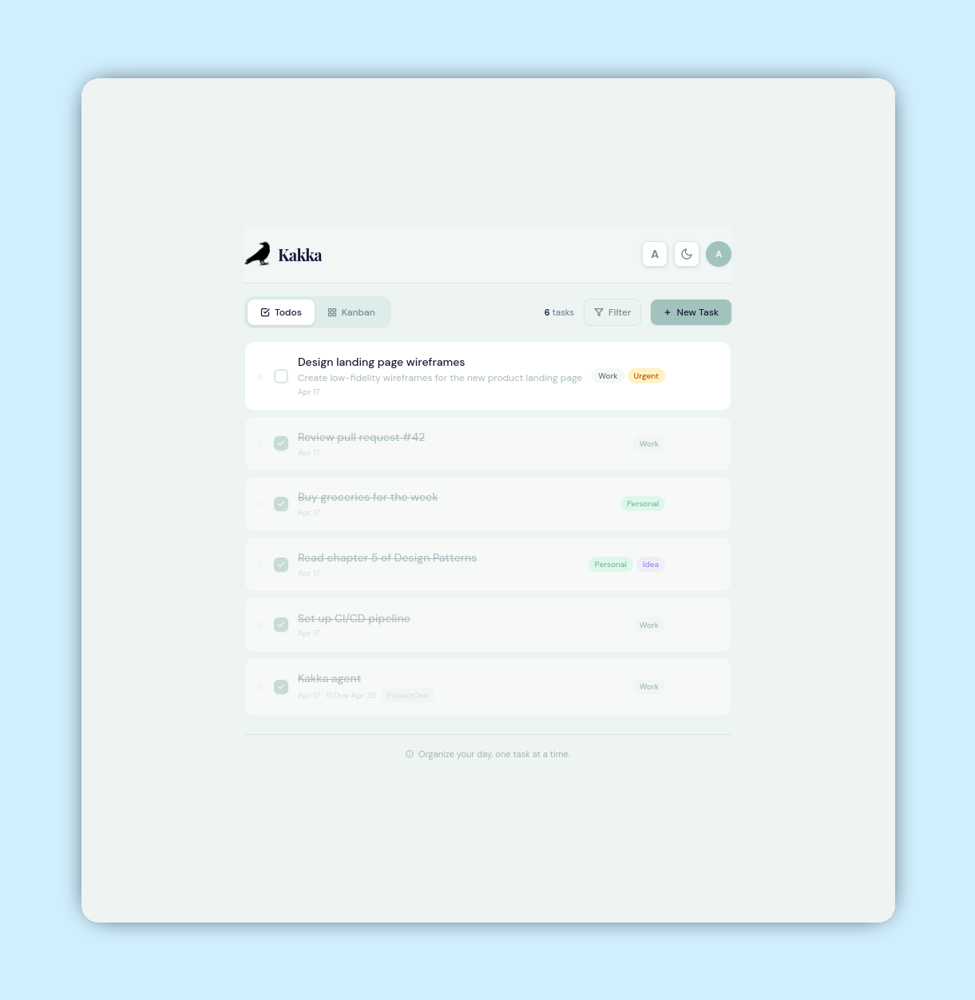
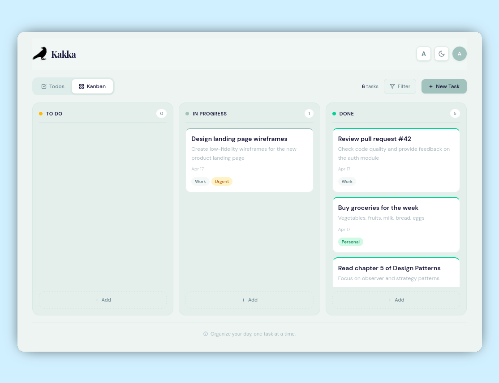

# Kakka

_"Kakka"_ — Tamil word for raven/crow. A minimalist task manager with Kanban and Todo list views, dark/light themes, markdown descriptions, and drag-and-drop — all in a self-contained full-stack app.

The idea of this app to build the long term memory and intelligence of the tasks one does.

_kakka_ does have that small, fine-grained, and intelligent memory and surprises with their behavior; so does this app as well.

_This app is developed through AI agents assisted_




---

## Table of Contents

- [Features](#features)
- [Tech Stack](#tech-stack)
- [Architecture](#architecture)
- [Getting Started](#getting-started)
  - [Prerequisites](#prerequisites)
  - [Local Development](#local-development)
  - [Production Build](#production-build)
  - [Podman](#docker)
- [Project Structure](#project-structure)
- [Task Data Model](#task-data-model)
- [REST API](#rest-api)
  - [Endpoints](#endpoints)
  - [Query Parameters](#query-parameters)
  - [Example Requests](#example-requests)
- [Frontend Details](#frontend-details)
  - [Views](#views)
  - [Theme System](#theme-system)
  - [Markdown Rendering](#markdown-rendering)
  - [Drag & Drop](#drag--drop)
  - [Animations](#animations)
  - [Design Tokens](#design-tokens)
- [Backend Details](#backend-details)
  - [Database](#database)
  - [Seed Data](#seed-data)
  - [CORS Configuration](#cors-configuration)
  - [Static File Serving](#static-file-serving)
- [Configuration](#configuration)
- [Known Issues & TODOs](#known-issues--todos)
- [License](#license)

---

## Features

| Category        | Details                                                                                                                        |
| --------------- | ------------------------------------------------------------------------------------------------------------------------------ |
| **Views**       | Todo list (with reorder) + Kanban board (3 columns) — fade/slide tab transition                                                |
| **Drag & Drop** | Kanban columns: drag cards between Todo/In Progress/Done. List view: reposition tasks. Both persist to backend                 |
| **Task CRUD**   | Create, edit, archive/unarchive (no hard delete). Modal dialog with title, description, tags, project, due date, status        |
| **Markdown**    | Full rendering in description overlay (headings, lists, code, bold/italic, hr). Inline preview truncated to 100 chars on cards |
| **Filters**     | Tag dropdown with checkbox multi-select, date picker, project text filter. Active filter pills shown                           |
| **Theme**       | Dark/light toggle with smooth 450ms transition. Persisted in `localStorage` key `df-theme`                                     |
| **Font Size**   | 3-step cycle: 16px → 19px → 23px (1.2x increments). Persisted in `localStorage` key `df-font`                                  |
| **Archive**     | Replaces delete. Archive button on tasks; user dropdown shows archived list with restore option                                |
| **Responsive**  | Mobile: stacked kanban columns. Desktop: 3-column grid. Independent column scrolling                                           |
| **Scrollbar**   | 12px wide, transparent track, sage-colored rounded thumb                                                                       |
| **Icons**       | Inline SVGs only — no external images, no icon fonts                                                                           |

---

## Tech Stack

| Layer              | Technology                                   | Version       |
| ------------------ | -------------------------------------------- | ------------- |
| Frontend Framework | Astro                                        | 6.1.x         |
| CSS                | TailwindCSS                                  | 4.x (not v3)  |
| Frontend Runtime   | Vanilla JavaScript                           | —             |
| Backend Framework  | FastAPI                                      | 0.115.x       |
| ORM                | SQLAlchemy                                   | 2.0.x (async) |
| Database           | SQLite (via aiosqlite)                       | —             |
| Package Manager    | Bun                                          | —             |
| Python             | 3.12+                                        | —             |
| Docker Base        | Alpine (python:3.12-alpine, oven/bun:alpine) | —             |

---

## Architecture

Two-package monorepo, no workspace tooling.

### System Architecture

```
┌──────────────────────────────────────────────────────────────────┐
│                        Browser (SPA)                             │
│  ┌──────────────────────────────────────────────────────────────┐│
│  │  Astro + TailwindCSS v4 + Vanilla JS                        ││
│  │  ┌─────────┐ ┌─────────┐ ┌──────────┐ ┌──────────────────┐ ││
│  │  │  Todos  │ │ Kanban  │ │  Graph   │ │      Chat        │ ││
│  │  │  List   │ │  Board  │ │  (vis.js)│ │  (KG-powered)    │ ││
│  │  └────┬────┘ └────┬────┘ └────┬─────┘ └───────┬──────────┘ ││
│  │       │           │           │               │             ││
│  │  ┌────┴───────────┴───────────┴───────────────┴──────┐      ││
│  │  │              fetch() /api/*                        │      ││
│  │  └─────────────────────┬──────────────────────────────┘      ││
│  └────────────────────────┼─────────────────────────────────────┘│
└────────────────────────────┼─────────────────────────────────────┘
                             │  HTTP (REST + JSON)
                             ▼
┌──────────────────────────────────────────────────────────────────┐
│                     FastAPI (uvicorn)                            │
│                                                                  │
│  ┌──────────────┐  ┌──────────────┐  ┌────────────────────┐     │
│  │  /api/tasks  │  │ /api/graph*  │  │    /api/chat        │     │
│  │  CRUD + list │  │  nodes/edges │  │  KG query engine    │     │
│  │  + reorder   │  │  + stats +   │  │  + action detection │     │
│  │  + tags      │  │  + timeline  │  │  + task creation    │     │
│  └──────┬───────┘  └──────┬───────┘  └──────┬─────────────┘     │
│         │                 │                  │                    │
│  ┌──────┴─────────────────┴──────────────────┴──────────────┐   │
│  │              SQLAlchemy Async ORM (aiosqlite)             │   │
│  └──────────────────────────┬───────────────────────────────┘   │
│                             │                                    │
│  ┌──────────────────────────┴───────────────────────────────┐   │
│  │                    SQLite (kakka.db)                      │   │
│  │                                                          │   │
│  │  ┌────────┐  ┌─────────┐  ┌─────────┐                   │   │
│  │  │ Task   │  │ Entity  │  │ Triple  │                   │   │
│  │  │ (CRUD) │  │ (nodes) │  │ (edges) │                   │   │
│  │  └────────┘  └─────────┘  └─────────┘                   │   │
│  └──────────────────────────────────────────────────────────┘   │
│                                                                  │
│  ┌──────────────────────────────────────────────────────────┐   │
│  │  KG Sync Hooks (task create → sync to graph entities)   │   │
│  └──────────────────────────────────────────────────────────┘   │
└──────────────────────────────────────────────────────────────────┘
```

### Data Flow

```
 User Action           Frontend              Backend              Database
 ───────────           ─────────             ───────              ────────

 Create task ──► POST /api/tasks ──► Task CRUD ──► INSERT Task
                                          │
                                          └──► sync_task_to_graph()
                                                └──► INSERT Entity + Triple

 Drag kanban ──► PUT /api/tasks/id ──► Update status
                                          │
                                          └──► sync_task_update_graph()
                                                └──► UPDATE Triple (expire old)
                                                    INSERT Triple (new fact)

 Chat query ───► POST /api/chat ──────► query_kg()
                                            │
                                            ├──► detect_action() ──► PUT task status
                                            ├──► tag/status filter ──► SELECT tasks
                                            └──► entity lookup ────► SELECT entities/triples

 Graph view ──► GET /api/graph ──────► SELECT entities + triples
 Stats ───────► GET /api/graph/stats ─► COUNT queries
```

### Project Structure

```
kakka/
├── backend/              # FastAPI async REST API
│   ├── main.py           # App entry, lifespan, CORS, static mount
│   ├── database.py       # SQLAlchemy models, async session, seed data
│   ├── models.py         # Pydantic schemas (TaskCreate, TaskUpdate, TaskOut, Chat*)
│   ├── routers.py        # All /api/ endpoints (tasks, graph, chat)
│   ├── chat.py           # KG query engine (no LLM — pure Python pattern matching)
│   ├── kg_sync.py        # KG sync hooks (task ↔ entity/triple)
│   ├── requirements.txt  # Python dependencies
│   └── kakka.db          # SQLite database (auto-created)
├── frontend/             # Astro SPA
│   ├── src/
│   │   ├── layouts/Layout.astro   # HTML shell, theme CSS, fonts, scrollbar
│   │   ├── pages/index.astro     # Single-page app (all markup + JS)
│   │   └── styles/global.css     # TailwindCSS v4 @theme tokens + @custom-variant
│   ├── astro.config.mjs
│   ├── package.json
│   └── public/
│       ├── favicon.svg
│       └── vis-network.min.js     # vis-network standalone UMD bundle
├── spec/                 # Design specifications and wireframes
│   ├── SPEC.md
│   ├── DESIGN.md
│   ├── design.html
│   ├── kanban-page.png
│   └── todo-list-page.png
├── Dockerfile
├── AGENTS.md
└── README.md
```

**Key constraint**: Frontend uses **vanilla JS only** — no React, Preact, or Svelte. All interactivity is in a single `<script is:inline>` block inside `index.astro`. Chat uses a **pure Python knowledge graph query engine** (no LLM/Ollama).

---

## Getting Started

### Prerequisites

- Python 3.12+
- Bun (or npm) for frontend build
- (Optional) Docker for containerized deployment

### Local Development

Two servers run simultaneously:

```bash
# Terminal 1 — Backend (port 8000)
cd backend
python3 -m venv .venv
source .venv/bin/activate   # or .venv\Scripts\activate on Windows
pip install -r requirements.txt
python3 -m uvicorn main:app --port 8000 --reload

# Terminal 2 — Frontend dev server (port 4321)
cd frontend
bun install
bun run dev
```

Open http://localhost:4321 — the Astro dev server proxies API calls to `http://localhost:8000/api`.

### Production Build

```bash
cd frontend
bun run build        # outputs to frontend/dist/
```

The backend serves `frontend/dist/` via `StaticFiles` mount on `/` when the directory exists. Start the backend and access http://localhost:8000 directly:

```bash
cd backend
python3 -m uvicorn main:app --host 0.0.0.0 --port 8000
```

### Podman

```bash
# Build the image
podman build -f Dockerfile -t kakka:0.1 .

# Run with persistent database
podman run -p 8000:8000 \
    -v ./kakka_data/kakka.db:/app/backend/kakka.db \
    localhost/kakka:0.1
```

The Dockerfile uses a multi-stage build:

1. **Builder stage** (`oven/bun:alpine`): Installs frontend deps and builds `frontend/dist/`
2. **Runtime stage** (`python:3.12-alpine`): Installs Python deps, copies backend + built frontend, runs uvicorn

The SQLite database is exposed as a Docker volume. Mount it to persist data across container restarts.

---

## Task Data Model

| Field         | Type       | Default  | Notes                                         |
| ------------- | ---------- | -------- | --------------------------------------------- |
| `id`          | int        | auto     | Auto-increment primary key                    |
| `title`       | str        | —        | Required                                      |
| `description` | str        | `""`     | Optional; supports markdown                   |
| `status`      | str        | `"todo"` | One of: `todo`, `progress`, `done`            |
| `done`        | bool       | `false`  | Derived: `true` when `status == "done"`       |
| `tags`        | JSON array | `[]`     | e.g. `["work", "urgent"]`                     |
| `project`     | str        | `""`     | Optional grouping (stored as `grp` in DB)     |
| `due_date`    | str        | `""`     | Optional ISO date string                      |
| `archived`    | bool       | `false`  | Soft-delete; archived tasks hidden by default |
| `sort_order`  | int        | `0`      | Position for manual reordering                |
| `created_at`  | str        | auto     | ISO 8601 timestamp                            |
| `updated_at`  | str        | auto     | ISO 8601 timestamp                            |

---

## REST API

All endpoints are prefixed with `/api/`.

### Endpoints

| Method   | Path                 | Description                           |
| -------- | -------------------- | ------------------------------------- |
| `GET`    | `/api/tasks`         | List tasks (with optional filters)    |
| `POST`   | `/api/tasks`         | Create a new task                     |
| `PUT`    | `/api/tasks/{id}`    | Update a task (partial update)        |
| `PUT`    | `/api/tasks/reorder` | Reorder tasks (body: `[id, id, ...]`) |
| `DELETE` | `/api/tasks/{id}`    | Delete a task permanently             |
| `GET`    | `/api/tags`          | List all distinct tags in use         |

> **Note**: `/api/tasks/reorder` must be matched before `/api/tasks/{id}`. The route is registered first in `routers.py`.

### Query Parameters

`GET /api/tasks` accepts:

| Param      | Type   | Default | Description                                           |
| ---------- | ------ | ------- | ----------------------------------------------------- |
| `tag`      | string | —       | Filter by tag (exact match within JSON array)         |
| `status`   | string | —       | Filter by status: `todo`, `progress`, `done`          |
| `date`     | string | —       | Filter by creation date (`YYYY-MM-DD`)                |
| `archived` | bool   | `false` | `true` = show archived only, omit = show non-archived |

Results ordered by `sort_order ASC`, then `id ASC`.

### Example Requests

```bash
# Create a task
curl -X POST http://localhost:8000/api/tasks \
  -H "Content-Type: application/json" \
  -d '{"title":"Write docs","status":"todo","tags":["work"],"project":"kakka"}'

# List non-archived tasks
curl http://localhost:8000/api/tasks

# Filter by tag
curl "http://localhost:8000/api/tasks?tag=work"

# Move task to "done" (kanban drag)
curl -X PUT http://localhost:8000/api/tasks/1 \
  -H "Content-Type: application/json" \
  -d '{"status":"done"}'

# Reorder tasks
curl -X PUT http://localhost:8000/api/tasks/reorder \
  -H "Content-Type: application/json" \
  -d '[3,1,2,5,4]'

# Archive a task
curl -X PUT http://localhost:8000/api/tasks/1 \
  -H "Content-Type: application/json" \
  -d '{"archived":true}'

# Get all tags
curl http://localhost:8000/api/tags
```

---

## Frontend Details

### Views

The app is a single-page application with two tab-switchable views:

1. **Todo List** — Vertical checklist with checkboxes, drag-reorder handles, inline description preview (100 chars), tags, project badges, date stamps, and archive/edit actions on hover.
2. **Kanban Board** — Three columns (To Do, In Progress, Done) with independent scrolling. Cards show title, truncated description, date, due date, project badge, and tags. Drag between columns to change status.

Both views support:

- Double-click to open edit modal
- Filter bar (tag dropdown with checkboxes, date picker, project text input)
- Archive/unarchive via modal or card action

### Theme System

- **Toggle**: Click sun/moon icon in header
- **Mechanism**: Adds/removes `class="dark"` on `<html>` element
- **Transition**: `theme-transition` class applies 450ms `*` transition, then removes it
- **Persistence**: `localStorage` key `df-theme` stores `"light"` or `"dark"`
- **Auto-detect**: On first visit, checks `prefers-color-scheme: dark`
- **CSS**: TailwindCSS v4 `@custom-variant dark (&:where(.dark, .dark *))` in `global.css`

### Markdown Rendering

Two rendering functions:

- **`md(text)`** — Full rendering for overlay dialog: headings (`#`, `##`, `###`), bold/italic, inline code, unordered/ordered lists, horizontal rules, line breaks. HTML-escaped first, then regex-replaced.
- **`descPreview(text)`** — Inline-only rendering for card previews: bold, italic, inline code. Strips markdown markers (`#`, `-`, `1.`, `---`). Joins lines with spaces. Truncates to 100 characters.

### Drag & Drop

Uses the **HTML5 native Drag API** (no libraries):

- **Kanban**: Cards have `draggable="true"` with `data-id`. Columns have `data-status` and accept drops via `dragover`/`drop` events. On drop, sends `PUT /api/tasks/{id}` with new `status`.
- **List**: Items have `draggable="true"` with `data-list-id`. Drag-reorder moves DOM elements in real-time. On drop, sends `PUT /api/tasks/reorder` with the new ID order array.

### Animations

| Animation        | Implementation                                                                            |
| ---------------- | ----------------------------------------------------------------------------------------- |
| `fadeUp`         | CSS class applied once per new task (tracked by `seenIds` Set). Card slides up + fades in |
| `card-lift`      | CSS hover transition: `transform: translateY(-1px)` + shadow increase                     |
| Modal open/close | Background blur + overlay, content fades in                                               |
| Tab switch       | Opacity 0→1 + translateY(4px)→0 with 250ms ease transition                                |
| Toast            | Fixed bottom-right, auto-dismiss after 3s                                                 |
| Theme toggle     | 450ms transition on all color properties                                                  |

### Design Tokens

Custom TailwindCSS v4 `@theme` tokens (defined in `global.css`):

| Token          | Light     | Dark |
| -------------- | --------- | ---- |
| `navy`         | `#19183B` | —    |
| `navy-light`   | `#22214A` | —    |
| `navy-lighter` | `#2C2B5E` | —    |
| `slate`        | `#708993` | —    |
| `slate-light`  | `#8BA3AC` | —    |
| `slate-dark`   | `#5A717B` | —    |
| `sage`         | `#A1C2BD` | —    |
| `sage-light`   | `#B8D4CF` | —    |
| `sage-dark`    | `#7FA8A2` | —    |
| `sage-pale`    | `#D4E8E4` | —    |
| `mint`         | `#E7F2EF` | —    |
| `mint-light`   | `#F0F7F5` | —    |
| `mint-dark`    | `#D0E4DF` | —    |

Fonts: **DM Sans** (body), **Playfair Display** (headings via `font-display`).

---

## Backend Details

### Database

- **Engine**: SQLAlchemy async with `aiosqlite` driver
- **URL**: `sqlite+aiosqlite:///<path>/backend/kakka.db`
- **Models**: `Task` ORM model with mapped columns
- **Session**: `async_sessionmaker` with `expire_on_commit=False`
- **Timestamps**: `before_insert` event hook sets `created_at` and `updated_at`

The database file `kakka.db` is auto-created on first startup. Tables are created via `Base.metadata.create_all()` inside the lifespan context.

### Seed Data

On first startup, if the `tasks` table is empty, 7 seed tasks are inserted:

| #   | Title                             | Status   | Tags           |
| --- | --------------------------------- | -------- | -------------- |
| 1   | Design landing page wireframes    | todo     | work, urgent   |
| 2   | Review pull request #42           | progress | work           |
| 3   | Buy groceries for the week        | todo     | personal       |
| 4   | Read chapter 5 of Design Patterns | progress | personal, idea |
| 5   | Fix navigation responsive bug     | done     | work, urgent   |
| 6   | Set up CI/CD pipeline             | todo     | work           |
| 7   | Morning meditation routine        | done     | personal       |

### CORS Configuration

Allowed origins (in `main.py`):

- `http://localhost:8000`
- `http://localhost:4321`
- `http://localhost:3000`

All methods and headers are permitted. Credentials are allowed.

### Static File Serving

When `frontend/dist/` directory exists, the backend mounts it at `/` using `StaticFiles(html=True)`. This means the backend can serve the built frontend directly in production — no separate web server needed.

Route priority: `/api/` routes are matched first (via `include_router`), then static files catch everything else.

---

## Configuration

| Setting               | Location                         | Default                                              |
| --------------------- | -------------------------------- | ---------------------------------------------------- |
| CORS origins          | `backend/main.py`                | `localhost:8000`, `localhost:4321`, `localhost:3000` |
| Database path         | `backend/database.py`            | `backend/kakka.db`                                   |
| Frontend dist path    | `backend/main.py`                | `../frontend/dist`                                   |
| API base URL          | `frontend/src/pages/index.astro` | `http://localhost:8000/api`                          |
| Theme storage key     | Frontend JS                      | `df-theme`                                           |
| Font size storage key | Frontend JS                      | `df-font`                                            |
| Font size steps       | Frontend JS                      | 16px, 19px, 23px                                     |

---

## Known Issues & TODOs

- [ ] Visual polish review — ensure modern animations look smooth
- [ ] End-to-end browser testing
- [ ] No automated tests (backend or frontend)
- [ ] List drag-reorder uses basic HTML5 DnD — could be smoother
- [ ] Seed data doesn't include `due_date` values
- [ ] Mobile responsiveness for kanban columns could be improved

---

## Attributions

[Kakka Icon] (https://www.flaticon.com/free-icon/raven_92031)

## License

MIT
