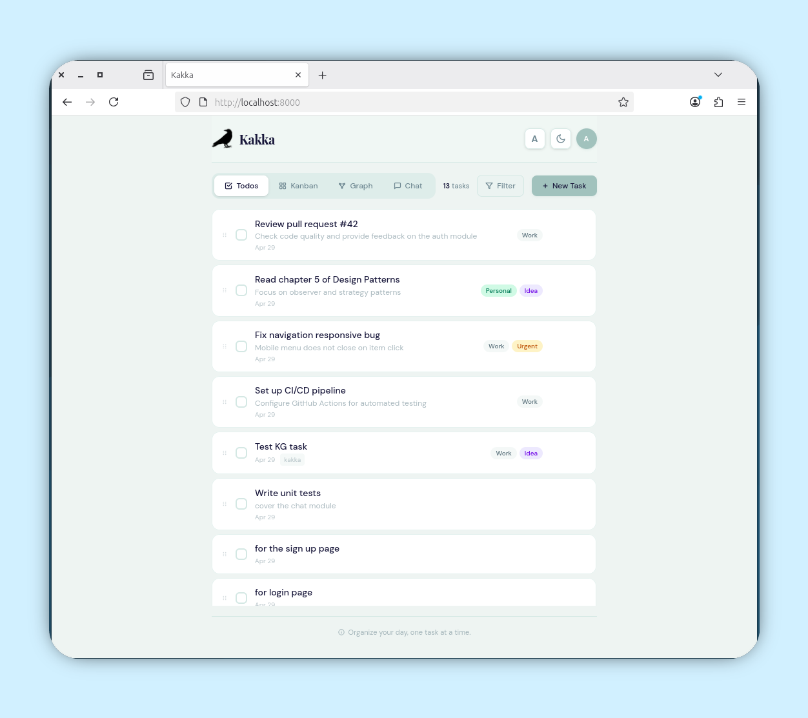
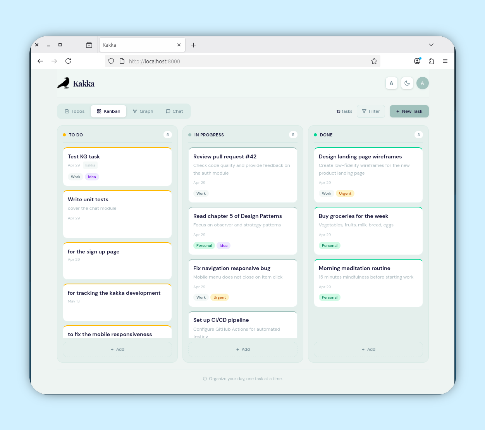
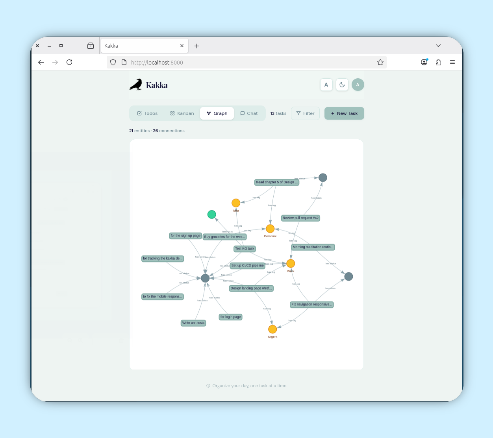
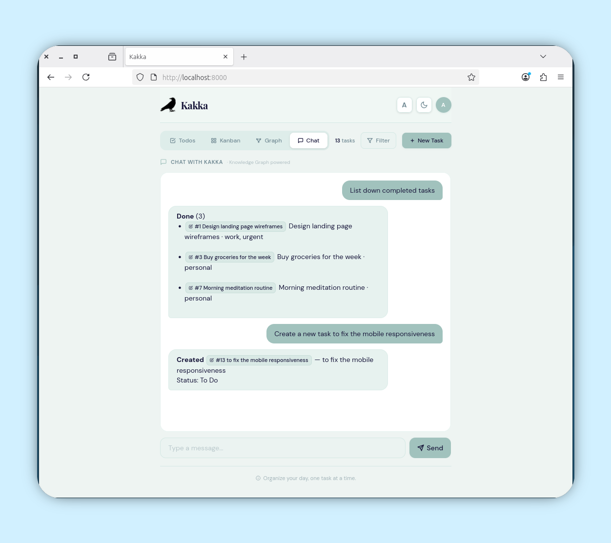

# Kakka


_"Kakka"_ — Tamil word for raven/crow. Crow are known for their remarkable long-term memory, fine-grained intelligence, and surprising problem-solving behavior. This app brings those same qualities to task management.

**Kakka is a task manager that remembers.** Every task you create, tag, move, and complete feeds into a temporal knowledge graph — an interconnected memory of your work that you can query and act on through natural language.

_This project built through AI Assisted._

| Todo                          | Kanban                          | Graph                          | Chat                          |
| ----------------------------- | ------------------------------- | ------------------------------ | ----------------------------- |
|  |  |  |  |

---

## Table of Contents

- [Features](#features)
- [How Kakka Remembers](#how-kakka-remembers)
- [Tech Stack](#tech-stack)
- [Architecture](#architecture)
- [Getting Started](#getting-started)
  - [Prerequisites](#prerequisites)
  - [Local Development](#local-development)
  - [Production Build](#production-build)
  - [Podman](#docker)
- [Project Structure](#project-structure)
- [Task Data Model](#task-data-model)
- [Knowledge Graph Data Model](#knowledge-graph-data-model)
- [REST API](#rest-api)
  - [Task Endpoints](#task-endpoints)
  - [Knowledge Graph Endpoints](#knowledge-graph-endpoints)
  - [Chat Endpoint](#chat-endpoint)
  - [Query Parameters](#query-parameters)
  - [Example Requests](#example-requests)
- [Chat Queries & Actions](#chat-queries--actions)
- [Frontend Details](#frontend-details)
  - [Views](#views)
  - [Theme System](#theme-system)
  - [Markdown Rendering](#markdown-rendering)
  - [Drag & Drop](#drag--drop)
  - [Animations](#animations)
  - [Design Tokens](#design-tokens)
- [Backend Details](#backend-details)
  - [Database](#database)
  - [Seed Data](#seed-data)
  - [CORS Configuration](#cors-configuration)
  - [Static File Serving](#static-file-serving)
- [Configuration](#configuration)
- [Known Issues & TODOs](#known-issues--todos)
- [Attributions](#attributions)
- [License](#license)

---

## Features

| Category        | Details                                                                                                                                                                                            |
| --------------- | -------------------------------------------------------------------------------------------------------------------------------------------------------------------------------------------------- |
| **Views**       | Todo list (with reorder) + Kanban board (3 columns) + Knowledge Graph + Chat — fade/slide tab transition                                                                                           |
| **Drag & Drop** | Kanban columns: drag cards between Todo/In Progress/Done. List view: reposition tasks. Both persist to backend                                                                                     |
| **Task CRUD**   | Create, edit, archive/unarchive (no hard delete). Modal dialog with title, description, tags, project, due date, status                                                                            |
| **Memory**      | Every task action syncs to a temporal knowledge graph. Tags, projects, and statuses become interconnected entities                                                                                 |
| **Graph View**  | vis-network force-directed graph. Nodes colored by type: task (sage), tag (amber), project (emerald), concept (slate)                                                                              |
| **Chat**        | Natural language queries and actions against your task memory. Supports tag/status/project filters, task creation, status actions, and entity lookups — powered by the knowledge graph, not an LLM |
| **Markdown**    | Full rendering in description overlay (headings, lists, code, bold/italic, hr). Inline preview truncated to 100 chars on cards                                                                     |
| **Filters**     | Tag dropdown with checkbox multi-select, date picker, project text filter. Active filter pills shown                                                                                               |
| **Theme**       | Dark/light toggle with smooth 450ms transition. Persisted in `localStorage` key `df-theme`                                                                                                         |
| **Font Size**   | 3-step cycle: 16px → 19px → 23px (1.2x increments). Persisted in `localStorage` key `df-font`                                                                                                      |
| **Archive**     | Replaces delete. Archive button on tasks; user dropdown shows archived list with restore option                                                                                                    |
| **Responsive**  | Mobile: stacked kanban columns. Desktop: 3-column grid. Independent column scrolling                                                                                                               |
| **Scrollbar**   | 12px wide, transparent track, sage-colored rounded thumb                                                                                                                                           |
| **Icons**       | Inline SVGs only — no external images, no icon fonts                                                                                                                                               |

---

## How Kakka Remembers

Most task managers are flat lists. Kakka builds an interconnected memory of your tasks through a **temporal knowledge graph** called **MemPalace**.

### The Problem with Flat Task Lists

A flat list can answer "What tasks do I have?" but not:

- "What tasks are connected to the `work` tag?"
- "What did I move to done this week?"
- "Which projects share the `urgent` tag?"
- "Show me everything related to Task #3"

MemPalace solves this by turning every task, tag, project, and status into entities connected by typed relationships — and remembering how those relationships change over time.

### Memory Architecture

```
  Your Action              MemPalace Sync                    Knowledge Graph
  ───────────              ──────────────                    ────────────────

  Create task ────────► sync_task_to_graph() ──────────────► task:5 entity created
                          │                                     │
                          ├─► upsert_entity(task:5)             ├─► has_tag → tag:work
                          ├─► create_triple(has_tag)            ├─► belongs_to → project:kakka
                          ├─► create_triple(belongs_to)         └─► has_status → status:todo
                          └─► create_triple(has_status)

  Move to done ───────► sync_task_update_graph() ───────────► Old fact expired, new fact created
                          │                                     │
                          ├─► invalidate_triples(has_status)    ├─► has_status → status:done  ✓ current
                          └─► create_triple(has_status)         └─► has_status → status:todo  ✗ expired
                                                                      (valid_to = timestamp)

  Delete task ────────► sync_task_delete_graph() ───────────► All task:3 triples expired
                                                                (valid_to = timestamp)
```

### Entity Types

| Type    | ID Format        | Example         | Color   |
| ------- | ---------------- | --------------- | ------- |
| Task    | `task:{id}`      | `task:1`        | sage    |
| Tag     | `tag:{name}`     | `tag:work`      | amber   |
| Project | `project:{name}` | `project:kakka` | emerald |
| Concept | `{kind}:{value}` | `status:todo`   | slate   |

### Relationship Types (Predicates)

| Predicate    | Subject → Object           | Meaning                   |
| ------------ | -------------------------- | ------------------------- |
| `has_tag`    | `task:1` → `tag:work`      | Task has this tag         |
| `belongs_to` | `task:1` → `project:kakka` | Task belongs to project   |
| `has_status` | `task:1` → `status:todo`   | Task currently has status |

### Temporal Versioning

Every triple has `valid_from` and `valid_to` timestamps. When a task's status changes from `todo` to `progress`:

1. The old triple `task:1 —has_status→ status:todo` gets `valid_to = <now>`
2. A new triple `task:1 —has_status→ status:progress` is created with `valid_to = null`

Graph queries filter to `valid_to IS NULL` to show only current facts. The timeline endpoint returns the full history, including expired facts.

### Chat: Querying the Memory

The chat engine (`chat.py`) is a **pure Python pattern matcher** — no LLM, no external API. It processes your message through a pipeline:

```
  User Message
       │
       ▼
  ┌─────────────────┐    ┌──────────────────┐
  │ Create Pattern?  │    │  Action Pattern?  │
  │ "add task X..."  │    │  "mark #3 done"   │
  └────────┬────────┘    └────────┬──────────┘
           │                      │
      Creates task           Updates status
      + syncs to KG           in DB directly
           │                      │
           ▼                      ▼
      ┌────────────────────────────────┐
      │     Still no match?            │
      │                                │
      │  Try: tag filter ──────────►   │
      │  Try: status filter ───────►  │
      │  Try: project filter ──────►  │
      │  Try: entity name match ───►  │
      │  Try: #ID reference ───────►  │
      │  Try: overview keywords ───►  │
      │  Fallback: keyword search ─►   │
      │  Last resort: "no match" ──►   │
      └────────────┬───────────────────┘
                   │
                   ▼
          _format_response()
          Builds markdown reply with
          [Task #3](task:3) clickable pills
          + list of TaskRef objects
```

The chat can:

- **Answer questions**: "what's in progress?", "show me work tasks", "what relates to project kakka?"
- **Take actions**: "mark #3 as done", "start task #1", "reopen #5"
- **Create tasks**: "add task Review the design with description Check mockups"
- **Show connections**: single task view reveals all linked entities (tags, project, related tasks)

The frontend renders `[Task #ID](task:ID)` references as clickable pill buttons that open the task editor, and auto-refreshes the task list when a chat response includes `changed: true`.

---

## Tech Stack

| Layer               | Technology                                   | Version       |
| ------------------- | -------------------------------------------- | ------------- |
| Frontend Framework  | Astro                                        | 6.1.x         |
| CSS                 | TailwindCSS                                  | 4.x (not v3)  |
| Frontend Runtime    | Vanilla JavaScript                           | —             |
| Graph Visualization | vis-network (standalone UMD)                 | 9.x           |
| Backend Framework   | FastAPI                                      | 0.115.x       |
| ORM                 | SQLAlchemy                                   | 2.0.x (async) |
| Database            | SQLite (via aiosqlite)                       | —             |
| Package Manager     | Bun                                          | —             |
| Python              | 3.12+                                        | —             |
| Docker Base         | Alpine (python:3.12-alpine, oven/bun:alpine) | —             |

---

## Architecture

Two-package monorepo, no workspace tooling.

### System Architecture

```
┌──────────────────────────────────────────────────────────────────┐
│                        Browser (SPA)                             │
│  ┌──────────────────────────────────────────────────────────────┐│
│  │  Astro + TailwindCSS v4 + Vanilla JS                        ││
│  │                                                              ││
│  │  ┌─────────┐ ┌─────────┐ ┌──────────┐ ┌────────────────┐ ││
│  │  │  Todos  │ │ Kanban  │ │  Graph   │ │     Chat        │ ││
│  │  │  List   │ │  Board  │ │ (vis.js) │ │  (MemPalace)   │ ││
│  │  └────┬────┘ └────┬────┘ └────┬─────┘ └───────┬─────────┘ ││
│  │       │           │           │                │            ││
│  │  ┌────┴───────────┴───────────┴────────────────┴────────┐  ││
│  │  │                   fetch() /api/*                      │  ││
│  │  └────────────────────────┬──────────────────────────────┘  ││
│  └───────────────────────────┼─────────────────────────────────┘│
└──────────────────────────────┼──────────────────────────────────┘
                               │  HTTP (REST + JSON)
                               ▼
┌──────────────────────────────────────────────────────────────────┐
│                     FastAPI (uvicorn)                            │
│                                                                  │
│  ┌──────────────┐  ┌──────────────┐  ┌────────────────────┐   │
│  │  /api/tasks  │  │ /api/graph*  │  │    /api/chat         │   │
│  │  CRUD + list │  │  nodes/edges │  │  Pattern matching    │   │
│  │  + reorder   │  │  + stats +   │  │  + action detection  │   │
│  │  + tags      │  │  + timeline  │  │  + task creation     │   │
│  └──────┬───────┘  └──────┬───────┘  └──────┬─────────────┘   │
│         │                 │                  │                  │
│  ┌──────┴─────────────────┴──────────────────┴──────────────┐  │
│  │              SQLAlchemy Async ORM (aiosqlite)              │  │
│  └──────────────────────────┬────────────────────────────────┘  │
│                             │                                    │
│  ┌──────────────────────────┴────────────────────────────────┐  │
│  │                    SQLite (kakka.db)                        │  │
│  │                                                            │  │
│  │  ┌────────────┐  ┌─────────────┐  ┌────────────────────┐  │  │
│  │  │   Task     │  │   Entity    │  │      Triple        │  │  │
│  │  │  (CRUD)    │  │  (KG nodes) │  │  (KG edges/temporal│  │  │
│  │  └────────────┘  └─────────────┘  └────────────────────┘  │  │
│  └────────────────────────────────────────────────────────────┘  │
│                                                                  │
│  ┌────────────────────────────────────────────────────────────┐  │
│  │  KG Sync Hooks                                             │  │
│  │  task create  ──► sync_task_to_graph()    (new entities)  │  │
│  │  task update  ──► sync_task_update_graph() (expire+create) │  │
│  │  task delete  ──► sync_task_delete_graph()(expire all)     │  │
│  └────────────────────────────────────────────────────────────┘  │
└──────────────────────────────────────────────────────────────────┘
```

### Data Flow

```
 User Action           Frontend              Backend              Database
 ───────────           ─────────             ───────              ────────

 Create task ──► POST /api/tasks ──► Task CRUD ──► INSERT Task
                                          │
                                          └──► sync_task_to_graph()
                                                ├──► INSERT Entity (task:N, tags, project)
                                                └──► INSERT Triple  (has_tag, belongs_to, has_status)

 Drag kanban ──► PUT /api/tasks/id ──► Update status
                                          │
                                          └──► sync_task_update_graph()
                                                ├──► UPDATE Triple SET valid_to=<now>  (expire old facts)
                                                └──► INSERT Triple                   (create new facts)

 Delete task ──► DELETE /api/tasks/id ──► Delete
                                                └──► sync_task_delete_graph()
                                                      └──► UPDATE Triple SET valid_to=<now>  (expire all)

 Chat query ───► POST /api/chat ──────► query_kg()
                                            ├──► detect_action() ──► UPDATE Task status
                                            ├──► tag filter ───────► SELECT tasks WHERE tag
                                            ├──► status filter ────► SELECT tasks WHERE status
                                            ├──► project filter ──► SELECT tasks WHERE project
                                            ├──► entity lookup ───► SELECT Entity + Triple
                                            ├──► keyword search ──► SELECT tasks WHERE match
                                            └──► format response ─► markdown + TaskRef[]

 Graph view ───► GET /api/graph ──────► SELECT entities + current triples
 Entity detail ─► GET /api/graph/entity/id ──► SELECT Entity + outgoing/incoming
 Stats ─────────► GET /api/graph/stats ──► COUNT entities, triples, current, expired
 Timeline ──────► GET /api/graph/timeline/id ──► SELECT all triples (including expired)
```

### Project Structure

```
kakka/
├── backend/              # FastAPI async REST API
│   ├── main.py           # App entry, lifespan, CORS, static mount
│   ├── database.py       # SQLAlchemy models (Task, Entity, Triple), session, seed data
│   ├── models.py         # Pydantic schemas (Task*, Chat*, EntityOut, TripleOut, GraphData)
│   ├── routers.py        # All /api/ endpoints (tasks, graph, chat)
│   ├── chat.py           # KG query engine: regex pattern matching, task creation, actions
│   ├── kg_sync.py        # MemPalace sync hooks (task ↔ entity/triple)
│   ├── requirements.txt  # Python dependencies
│   └── kakka.db          # SQLite database (auto-created)
├── frontend/             # Astro SPA
│   ├── src/
│   │   ├── layouts/Layout.astro   # HTML shell, theme CSS, fonts, scrollbar, vis-network
│   │   ├── pages/index.astro     # Single-page app (all markup + vanilla JS)
│   │   └── styles/global.css     # TailwindCSS v4 @theme tokens + @custom-variant dark
│   ├── astro.config.mjs          # Astro config with TailwindCSS v4 Vite plugin
│   ├── package.json
│   └── public/
│       ├── kakka.png             # Favicon/logo
│       └── vis-network.min.js    # vis-network standalone UMD bundle
├── api/                  # API specification
│   └── openapi.yaml      # OpenAPI 3.0.3 specification
├── spec/                 # Design specifications and wireframes
│   ├── SPEC.md
│   ├── DESIGN.md
│   └── design.html
├── docs/                 # Screenshots
├── Dockerfile
├── AGENTS.md
└── README.md
```

**Key constraints**:

- Frontend uses **vanilla JS only** — no React, Preact, or Svelte. All interactivity in a single `<script is:inline>` block inside `index.astro`.
- Chat uses a **pure Python knowledge graph query engine** (`chat.py`) — no LLM, no Ollama, no external API.
- MemPalace sync hooks run synchronously within task CRUD endpoints — every create/update/delete keeps the graph consistent.
- Graph triples are **temporal**: old facts get `valid_to` timestamps rather than being deleted, enabling timeline queries.

---

## Getting Started

### Prerequisites

- Python 3.12+
- Bun (or npm) for frontend build
- (Optional) Docker for containerized deployment

### Local Development

Two servers run simultaneously:

```bash
# Terminal 1 — Backend (port 8000)
cd backend
python3 -m venv .venv
source .venv/bin/activate   # or .venv\Scripts\activate on Windows
pip install -r requirements.txt
python3 -m uvicorn main:app --port 8000 --reload

# Terminal 2 — Frontend dev server (port 4321)
cd frontend
bun install
bun run dev
```

Open http://localhost:4321 — the Astro dev server proxies API calls to `http://localhost:8000/api`.

### Production Build

```bash
cd frontend
bun run build        # outputs to frontend/dist/
```

The backend serves `frontend/dist/` via `StaticFiles` mount on `/` when the directory exists. Start the backend and access http://localhost:8000 directly:

```bash
cd backend
python3 -m uvicorn main:app --host 0.0.0.0 --port 8000
```

### Podman

```bash
# Build the image
podman build -f Dockerfile -t kakka:0.1 .

# Run with persistent database
podman run -p 8000:8000 \
    -v ./kakka_data/kakka.db:/app/backend/kakka.db \
    localhost/kakka:0.1
```

The Dockerfile uses a multi-stage build:

1. **Builder stage** (`oven/bun:alpine`): Installs frontend deps and builds `frontend/dist/`
2. **Runtime stage** (`python:3.12-alpine`): Installs Python deps, copies backend + built frontend, runs uvicorn

The SQLite database is exposed as a Docker volume. Mount it to persist data across container restarts.

---

## Task Data Model

| Field         | Type       | Default  | Notes                                         |
| ------------- | ---------- | -------- | --------------------------------------------- |
| `id`          | int        | auto     | Auto-increment primary key                    |
| `title`       | str        | —        | Required                                      |
| `description` | str        | `""`     | Optional; supports markdown                   |
| `status`      | str        | `"todo"` | One of: `todo`, `progress`, `done`            |
| `done`        | bool       | `false`  | Derived: `true` when `status == "done"`       |
| `tags`        | JSON array | `[]`     | e.g. `["work", "urgent"]`                     |
| `project`     | str        | `""`     | Optional grouping (stored as `grp` in DB)     |
| `due_date`    | str        | `""`     | Optional ISO date string                      |
| `archived`    | bool       | `false`  | Soft-delete; archived tasks hidden by default |
| `sort_order`  | int        | `0`      | Position for manual reordering                |
| `created_at`  | str        | auto     | ISO 8601 timestamp                            |
| `updated_at`  | str        | auto     | ISO 8601 timestamp                            |

---

## Knowledge Graph Data Model

The knowledge graph stores two additional tables alongside `tasks`:

### Entity (Nodes)

| Field        | Type | Notes                                                               |
| ------------ | ---- | ------------------------------------------------------------------- |
| `id`         | str  | Namespaced ID: `task:1`, `tag:work`, `project:kakka`, `status:todo` |
| `name`       | str  | Human-readable label                                                |
| `type`       | str  | One of: `task`, `tag`, `project`, `concept`                         |
| `properties` | str  | JSON object (e.g. `{"color": "sage"}` for tags)                     |
| `created_at` | str  | ISO 8601 timestamp                                                  |

### Triple (Edges, Temporal)

| Field            | Type  | Notes                                                    |
| ---------------- | ----- | -------------------------------------------------------- |
| `id`             | int   | Auto-increment primary key                               |
| `subject`        | str   | Source entity ID (e.g. `task:1`)                         |
| `predicate`      | str   | Relationship type: `has_tag`, `belongs_to`, `has_status` |
| `object`         | str   | Target entity ID (e.g. `tag:work`)                       |
| `valid_from`     | str   | ISO timestamp when this fact became true                 |
| `valid_to`       | str   | ISO timestamp when expired, or `null` if current         |
| `confidence`     | float | Always `1.0` for auto-synced facts                       |
| `source_task_id` | int   | ID of the task that created this triple                  |
| `created_at`     | str   | ISO 8601 timestamp                                       |

**Temporality**: `valid_to IS NULL` means the fact is current. When a fact changes (e.g. task moves from `todo` to `progress`), the old triple gets `valid_to = <now>` and a new triple is created with `valid_to = null`. This preserves the full history of how tasks, tags, projects, and statuses evolved over time.

---

## REST API

All endpoints are prefixed with `/api/`. Full specification available at [`api/openapi.yaml`](api/openapi.yaml).

### Task Endpoints

| Method   | Path                 | Description                           |
| -------- | -------------------- | ------------------------------------- |
| `GET`    | `/api/tasks`         | List tasks (with optional filters)    |
| `POST`   | `/api/tasks`         | Create a new task                     |
| `PUT`    | `/api/tasks/{id}`    | Update a task (partial update)        |
| `PUT`    | `/api/tasks/reorder` | Reorder tasks (body: `[id, id, ...]`) |
| `DELETE` | `/api/tasks/{id}`    | Delete a task permanently             |
| `GET`    | `/api/tags`          | List all distinct tags in use         |

> **Note**: `/api/tasks/reorder` must be matched before `/api/tasks/{id}`. The route is registered first in `routers.py`.

### Knowledge Graph Endpoints

| Method | Path                       | Description                                          |
| ------ | -------------------------- | ---------------------------------------------------- |
| `GET`  | `/api/graph`               | Get all entities and current triples                 |
| `GET`  | `/api/graph/stats`         | Get entity/triple counts and relationship type stats |
| `GET`  | `/api/graph/entity/{id}`   | Get single entity with outgoing/incoming triples     |
| `GET`  | `/api/graph/timeline/{id}` | Get full temporal history for an entity              |

### Chat Endpoint

| Method | Path        | Description                                                                     |
| ------ | ----------- | ------------------------------------------------------------------------------- |
| `POST` | `/api/chat` | Send a message, get a response with optional action results and task references |

**Request body**: `{ "messages": [{ "role": "user", "content": "show me urgent tasks" }] }`

**Response**: `{ "content": "markdown string", "tasks": [{ "id": 1, "title": "...", "status": "todo", "changed": false }] }`

When `changed` is `true` on any task reference, the frontend auto-refreshes the task list.

### Query Parameters

`GET /api/tasks` accepts:

| Param      | Type   | Default | Description                                           |
| ---------- | ------ | ------- | ----------------------------------------------------- |
| `tag`      | string | —       | Filter by tag (exact match within JSON array)         |
| `status`   | string | —       | Filter by status: `todo`, `progress`, `done`          |
| `date`     | string | —       | Filter by creation date (`YYYY-MM-DD`)                |
| `archived` | bool   | `false` | `true` = show archived only, omit = show non-archived |

Results ordered by `sort_order ASC`, then `id ASC`.

### Example Requests

```bash
# Create a task
curl -X POST http://localhost:8000/api/tasks \
  -H "Content-Type: application/json" \
  -d '{"title":"Write docs","status":"todo","tags":["work"],"project":"kakka"}'

# List non-archived tasks
curl http://localhost:8000/api/tasks

# Filter by tag
curl "http://localhost:8000/api/tasks?tag=work"

# Move task to "done" (kanban drag)
curl -X PUT http://localhost:8000/api/tasks/1 \
  -H "Content-Type: application/json" \
  -d '{"status":"done"}'

# Reorder tasks
curl -X PUT http://localhost:8000/api/tasks/reorder \
  -H "Content-Type: application/json" \
  -d '[3,1,2,5,4]'

# Archive a task
curl -X PUT http://localhost:8000/api/tasks/1 \
  -H "Content-Type: application/json" \
  -d '{"archived":true}'

# Get all tags
curl http://localhost:8000/api/tags

# Get knowledge graph
curl http://localhost:8000/api/graph

# Get graph statistics
curl http://localhost:8000/api/graph/stats

# Get entity detail (task:1)
curl http://localhost:8000/api/graph/entity/task:1

# Get entity timeline
curl http://localhost:8000/api/graph/timeline/task:1

# Chat query
curl -X POST http://localhost:8000/api/chat \
  -H "Content-Type: application/json" \
  -d '{"messages":[{"role":"user","content":"what tasks are in progress?"}]}'

# Chat action: mark task #3 as done
curl -X POST http://localhost:8000/api/chat \
  -H "Content-Type: application/json" \
  -d '{"messages":[{"role":"user","content":"mark #3 as done"}]}'

# Chat: create a task
curl -X POST http://localhost:8000/api/chat \
  -H "Content-Type: application/json" \
  -d '{"messages":[{"role":"user","content":"add task \"Review design\" with description Check all mockups"}]}'
```

---

## Chat Queries & Actions

The chat engine processes messages through a pipeline of pattern matchers. Here's what you can say:

### Queries

| Pattern           | Example                            | Result                                   |
| ----------------- | ---------------------------------- | ---------------------------------------- |
| Greeting          | `hi`, `hello`, `help`              | Overview: task counts, tags, suggestions |
| Overview keywords | `all tasks`, `overview`, `summary` | Full task list grouped by status         |
| Tag filter        | `show work tasks`, `urgent`        | Tasks matching that tag                  |
| Status filter     | `what's in progress?`, `done`      | Tasks in that status                     |
| Project filter    | `project kakka`                    | Tasks in that project                    |
| Entity lookup     | Any word matching entity name      | Connected entities and related triples   |
| Task reference    | `task #3`, `#3`                    | Single task detail with connections      |
| Keyword search    | Fallback: words ≥ 3 chars          | Tasks with matching title/description    |

### Actions

| Pattern             | Example                        | Effect                    |
| ------------------- | ------------------------------ | ------------------------- |
| Mark as done        | `mark #3 as done`              | Sets status to `done`     |
| Mark as in progress | `start #1`, `mark #1 progress` | Sets status to `progress` |
| Move back to todo   | `reopen #5`, `mark #5 todo`    | Sets status to `todo`     |
| Quick status        | `#2 done`, `#2 in progress`    | Direct status change      |

### Task Creation

| Pattern                                          | Example                                                        |
| ------------------------------------------------ | -------------------------------------------------------------- |
| `add task "TITLE" with description DESC`         | `add task "Write tests" with description Unit and integration` |
| `create task called TITLE with description DESC` | `create task called Deploy with description Push to prod`      |
| `add task TITLE`                                 | `add task Buy groceries`                                       |

Chat responses include `[Task #ID](task:ID)` links rendered as clickable pill buttons in the frontend. When a response includes task references with `changed: true`, the frontend auto-refreshes the task list.

---

## Frontend Details

### Views

The app is a single-page application with four tab-switchable views:

1. **Todo List** — Vertical checklist with checkboxes, drag-reorder handles, inline description preview (100 chars), tags, project badges, date stamps, and archive/edit actions on hover.
2. **Kanban Board** — Three columns (To Do, In Progress, Done) with independent scrolling. Cards show title, truncated description, date, due date, project badge, and tags. Drag between columns to change status.
3. **Knowledge Graph** — vis-network force-directed graph visualization. Nodes colored by entity type. Double-click a task node to open the edit modal. Stats bar shows entity and connection counts.
4. **Chat** — Natural language interface to query and act on the knowledge graph. Messages render with markdown support and `[Task #ID](task:ID)` clickable pill buttons. Auto-refreshes task list on status changes.

All views support:

- Double-click to open edit modal
- Filter bar (tag dropdown with checkboxes, date picker, project text input)
- Archive/unarchive via modal or card action

### Theme System

- **Toggle**: Click sun/moon icon in header
- **Mechanism**: Adds/removes `class="dark"` on `<html>` element
- **Transition**: `theme-transition` class applies 450ms `*` transition, then removes it
- **Persistence**: `localStorage` key `df-theme` stores `"light"` or `"dark"`
- **Auto-detect**: On first visit, checks `prefers-color-scheme: dark`
- **CSS**: TailwindCSS v4 `@custom-variant dark (&:where(.dark, .dark *))` in `global.css`

### Markdown Rendering

Two rendering functions:

- **`md(text)`** — Full rendering for overlay dialog: headings (`#`, `##`, `###`), bold/italic, inline code, unordered/ordered lists, horizontal rules, line breaks. HTML-escaped first, then regex-replaced.
- **`descPreview(text)`** — Inline-only rendering for card previews: bold, italic, inline code. Strips markdown markers (`#`, `-`, `1.`, `---`). Joins lines with spaces. Truncates to 100 characters.

### Drag & Drop

Uses the **HTML5 native Drag API** (no libraries):

- **Kanban**: Cards have `draggable="true"` with `data-id`. Columns have `data-status` and accept drops via `dragover`/`drop` events. On drop, sends `PUT /api/tasks/{id}` with new `status`.
- **List**: Items have `draggable="true"` with `data-list-id`. Drag-reorder moves DOM elements in real-time. On drop, sends `PUT /api/tasks/reorder` with the new ID order array.

### Animations

| Animation        | Implementation                                                                            |
| ---------------- | ----------------------------------------------------------------------------------------- |
| `fadeUp`         | CSS class applied once per new task (tracked by `seenIds` Set). Card slides up + fades in |
| `card-lift`      | CSS hover transition: `transform: translateY(-1px)` + shadow increase                     |
| Modal open/close | Background blur + overlay, content fades in                                               |
| Tab switch       | Opacity 0→1 + translateY(4px)→0 with 250ms ease transition                                |
| Toast            | Fixed bottom-right, auto-dismiss after 3s                                                 |
| Theme toggle     | 450ms transition on all color properties                                                  |

### Design Tokens

Custom TailwindCSS v4 `@theme` tokens (defined in `global.css`):

| Token          | Light     | Dark |
| -------------- | --------- | ---- |
| `navy`         | `#19183B` | —    |
| `navy-light`   | `#22214A` | —    |
| `navy-lighter` | `#2C2B5E` | —    |
| `slate`        | `#708993` | —    |
| `slate-light`  | `#8BA3AC` | —    |
| `slate-dark`   | `#5A717B` | —    |
| `sage`         | `#A1C2BD` | —    |
| `sage-light`   | `#B8D4CF` | —    |
| `sage-dark`    | `#7FA8A2` | —    |
| `sage-pale`    | `#D4E8E4` | —    |
| `mint`         | `#E7F2EF` | —    |
| `mint-light`   | `#F0F7F5` | —    |
| `mint-dark`    | `#D0E4DF` | —    |

Graph node colors by entity type:

| Entity Type | Color   | Token           |
| ----------- | ------- | --------------- |
| task        | sage    | `--color-sage`  |
| tag         | amber   | `#F59E0B`       |
| project     | emerald | `#10B981`       |
| concept     | slate   | `--color-slate` |

Fonts: **DM Sans** (body), **Playfair Display** (headings via `font-display`).

---

## Backend Details

### Database

- **Engine**: SQLAlchemy async with `aiosqlite` driver
- **URL**: `sqlite+aiosqlite:///<path>/backend/kakka.db`
- **Models**: `Task`, `Entity`, `Triple` ORM models with mapped columns
- **Session**: `async_sessionmaker` with `expire_on_commit=False`
- **Timestamps**: `before_insert` event hook sets `created_at` and `updated_at`

The database file `kakka.db` is auto-created on first startup. Tables are created via `Base.metadata.create_all()` inside the lifespan context.

### Seed Data

On first startup, if the `tasks` table is empty, 7 seed tasks are inserted:

| #   | Title                             | Status   | Tags           |
| --- | --------------------------------- | -------- | -------------- |
| 1   | Design landing page wireframes    | todo     | work, urgent   |
| 2   | Review pull request #42           | progress | work           |
| 3   | Buy groceries for the week        | todo     | personal       |
| 4   | Read chapter 5 of Design Patterns | progress | personal, idea |
| 5   | Fix navigation responsive bug     | done     | work, urgent   |
| 6   | Set up CI/CD pipeline             | todo     | work           |
| 7   | Morning meditation routine        | done     | personal       |

Seed tasks also auto-sync to the knowledge graph via `sync_task_to_graph()`, creating corresponding entity and triple records.

### CORS Configuration

Allowed origins (in `main.py`):

- `http://localhost:8000`
- `http://localhost:4321`
- `http://localhost:3000`

All methods and headers are permitted. Credentials are allowed.

### Static File Serving

When `frontend/dist/` directory exists, the backend mounts it at `/` using `StaticFiles(html=True)`. This means the backend can serve the built frontend directly in production — no separate web server needed.

Route priority: `/api/` routes are matched first (via `include_router`), then static files catch everything else.

---

## Configuration

| Setting               | Location                         | Default                                              |
| --------------------- | -------------------------------- | ---------------------------------------------------- |
| CORS origins          | `backend/main.py`                | `localhost:8000`, `localhost:4321`, `localhost:3000` |
| Database path         | `backend/database.py`            | `backend/kakka.db`                                   |
| Frontend dist path    | `backend/main.py`                | `../frontend/dist`                                   |
| API base URL          | `frontend/src/pages/index.astro` | `http://0.0.0.0:8000/api`                            |
| Theme storage key     | Frontend JS                      | `df-theme`                                           |
| Font size storage key | Frontend JS                      | `df-font`                                            |
| Font size steps       | Frontend JS                      | 16px, 19px, 23px                                     |

---

## Known Issues & TODOs

- [ ] Visual polish review — ensure modern animations look smooth
- [ ] End-to-end browser testing
- [ ] No automated tests (backend or frontend)
- [ ] List drag-reorder uses basic HTML5 DnD — could be smoother
- [ ] Seed data doesn't include `due_date` values
- [ ] Mobile responsiveness for graph and chat views could be improved
- [ ] Chat engine could support more complex queries (AND/OR filters, date ranges)
- [ ] Knowledge graph backfill for existing data on schema upgrade

---

## Attributions

[Kakka Icon](https://www.flaticon.com/free-icon/raven_92031)

## License

MIT
